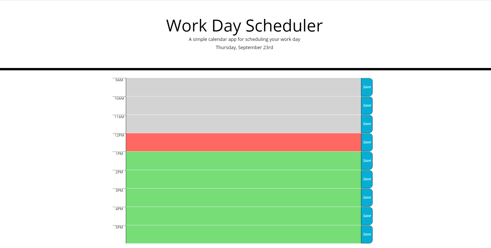

# day-planner

Used Jquery, Bootstrap and Moment to create a calendar with text input that saves to local storage upon button click + each hour is color coded based on current TOD.

https://robertcalder1.github.io/code-quiz/

